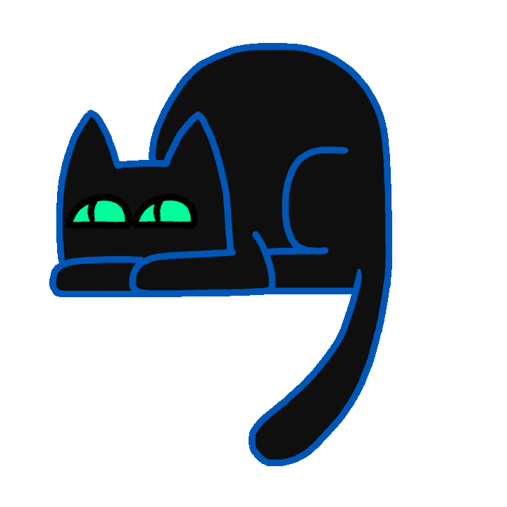

<!-- APRESENTAÇÃO -->
 

<h1 align="center">✨Hi, nice to meet you✨
    

</h1>

Welcome to my page, on GitHub!
 
     
    I am Vitor Carlos de Souza, full-stack programmer.
     
    Computer Engineering Student and RocketSeat.

    <!--spacing-3x-->

<!-- FOCO... -->
<h3 align="Left">
    A Beginner Developer Focused on Back-end | Full-Stack
</h3>
<!-- SOBRE MIM -->
- 🌱 I am currently studying Programmer Full-Stack at <a href="https://app.rocketseat.com.br/me/vitor-crl">Rocketseat</a> and <a href="https://www.esamc.br/unidade/Santos/"> Esamc Santos</a>.

- 👨🏻‍💻 I’m looking to collaborate on web projects and mobile

- 🤔 I’m looking for help with React and virtual machines

- ✉ How to reach me vitorcarlos1312@gmail.com

- ⚡ Fun fact i'm a big fan of Rick and Morty

<!--

**vitorcrl/vitorcrl** is a ✨ _special_ ✨ repository because its `README.md` (this file) appears on your GitHub profile.

Here are some ideas to get you started:

- 🔭 I’m currently working on ...
- 🌱 I’m currently learning ...
- 👯 I’m looking to collaborate on ...
- 🤔 I’m looking for help with ...
- 💬 Ask me about ...
- 📫 How to reach me: ...
- 😄 Pronouns: ...
- ⚡ Fun fact: ...
  -->
